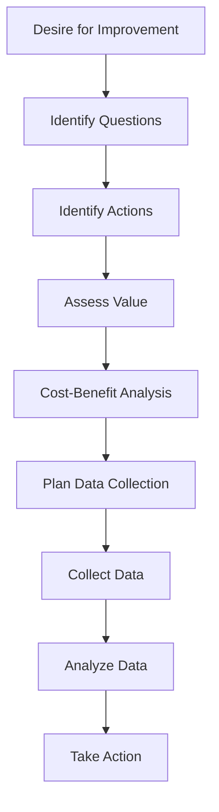

Recently, my brother shared a story that resonated with me and inspired this post. He talked about his excitement in purchasing a set of energy monitors for his home, only to find himself ignoring the data after the first week. His goal was to understand his energy consumption after a high bill, but without clear questions driving the data collection, the effort fizzled out.

This got me thinking about how often we see the same scenario play out in the world of project management and Scrum. We invest in tools and systems to collect all kinds of metrics, hoping they'll magically reveal insights. But just like my brother's energy monitors, without a clear purpose, these metrics often end up as digital shelfware—cool but unused.

## The Importance of Asking the Right Questions

Before diving into data collection, it’s crucial to ask ourselves: What do we really want to know? What questions are we hoping these metrics will answer? It’s easy to get caught up in the excitement of new tools and technologies, but without a focused approach, we risk wasting time and resources.

## The Process of Effective Metrics Collection

To make the most out of your metrics collection, consider these steps:

1. **Desire for Improvement:** Recognize the need or desire to make a decision to improve something.
2. **Identify Questions:** Determine the specific questions that, if answered, would enable a good and informed decision.
3. **Identify Actions:** Define the potential actions that would be taken based on the answers to these questions.
4. **Assess Value:** Evaluate the value of getting these answers and taking the identified actions.
5. **Cost-Benefit Analysis:** Decide if collecting data is worth it based on the value of the actions and the cost of data collection.
6. **Plan Data Collection:** Determine the resources (time and money) to allocate for collecting data and decide on the methods for data collection.
7. **Collect Data:** Gather the relevant data as planned.
8. **Analyze Data:** Format and interpret the data to specifically address the identified questions.
9. **Take Action:** Based on the insights gained from the data, take informed actions and aim to realize the value of these data-informed decisions.

As you can see in the flowchart[^1], the metrics collection step is just one step of many on the journey to actionable insights.

## Beyond the Basics: Expanding Your Metrics Approach

This post touches just the surface of metrics. There are lots of other angles and aspects to using metrics to drive actionable insights for your business. Here are a few more points for you to consider:

1. **Align Metrics with Business Goals:** Metrics should always align with your overarching goals, such as increasing revenue, improving customer satisfaction, or enhancing operational efficiency.

2. **Understand Your Target Audience:** Metrics related to customer demographics, behaviors, and preferences will help you tailor your strategies effectively.

3. **Identify Key Performance Indicators (KPIs):** KPIs are the key drivers of your business that directly impact your goals.

4. **Establish Review Cadence:** Regular reviews ensure that you stay on track and can make timely adjustments.

5. **Benchmark Against Industry Standards:** Comparing your metrics to industry benchmarks helps you understand where you stand relative to your peers.

6. **Balance Leading and Lagging Indicators:** Leading indicators help you anticipate problems and seize opportunities before they become evident in lagging metrics.

7. **Visualize Your Metrics:** Use charts, graphs, and dashboards to present your metrics in a way that's easy to understand at a glance.

8. **Ensure Proper Access:** The right people in your organization should have access to the metrics they need to perform their roles effectively.

9. **Be Willing to Adapt:** Don't be afraid to revise and refine your metrics as your business grows and changes.

Happy questioning and may your insights always be actionable!

## Footnotes

[^1]: Here is the Mermaid flowchart code used to create the flowchart:

